# Segmenting & Clustering Neighborhoods in Toronto
## To segment and cluster neighbourhhoods in a city of Canada based on common parameters.

**Author**: SHAILESH DHAMA

Clustering is an unsupervised machine learning method that segments similar data points into groups.These groups are called clusters.
It is considered as unsupervised because there is no ground truth value to predict.But,We intend to create structure/meaning from dataset.

On the other hand,Segmentation is a data analysis technique for creating groups from a dataset.

### Business problem:

To segment and cluster neighbourhhoods in a Toronto based on common parameters.

### DATASET : 

    Web Scraping from https://en.wikipedia.org/wiki/List_of_postal_codes_of_Canada:_M

## STEPS :

- Segmenting neighbourhoods
- Clustering the neighbourhoods in Toronto
- Final Clusters obtained after Clustering

## RESULTS :

#### Segmenting neighbourhoods
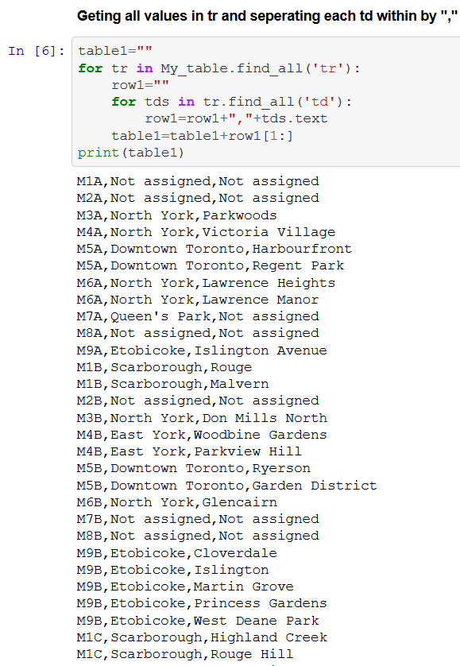
> Detailed Tabular Dataset.

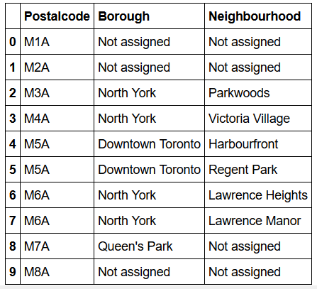
> Un-segmented Dataframes

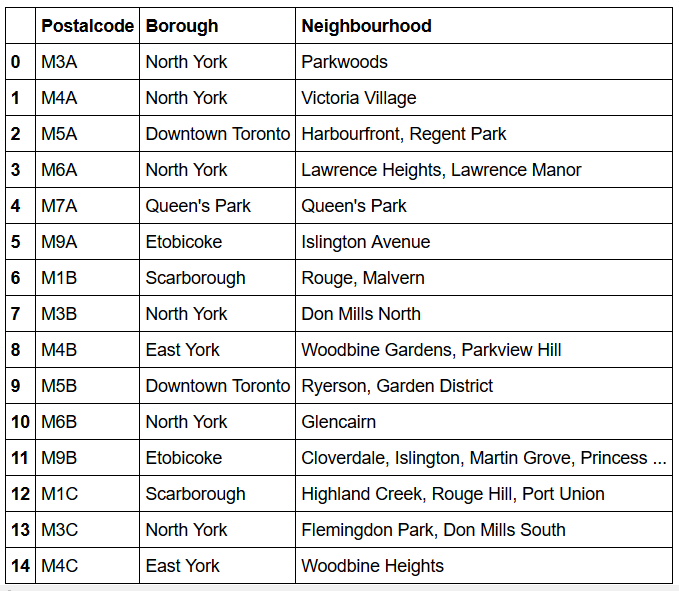
> Boroughs with their neighbourhoods

#### Clustering the neighbourhoods in Toronto

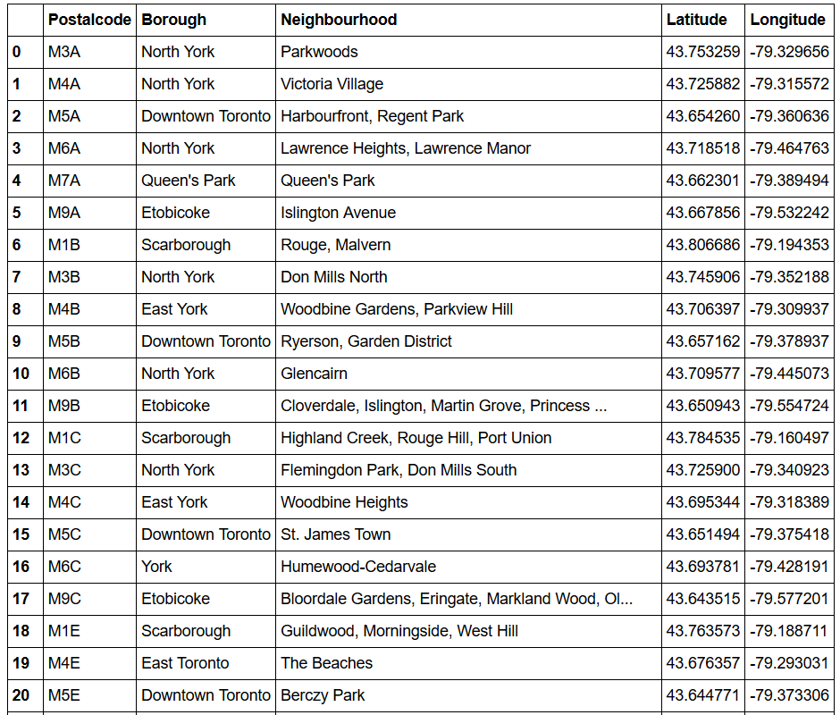
> Nearest Neighbourhoods of Toronto with latitudes and longitudes.

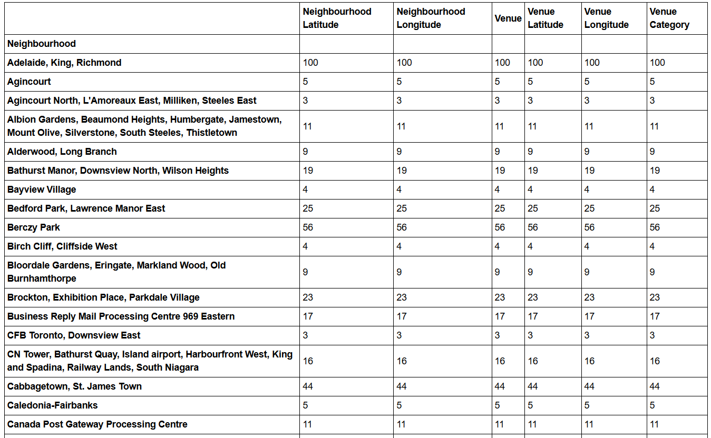
> Clustering the neighbourhoods in Toronto.

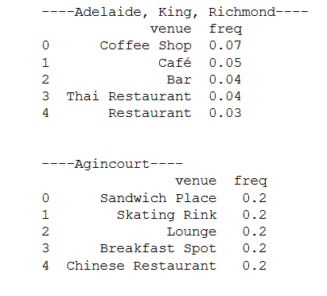
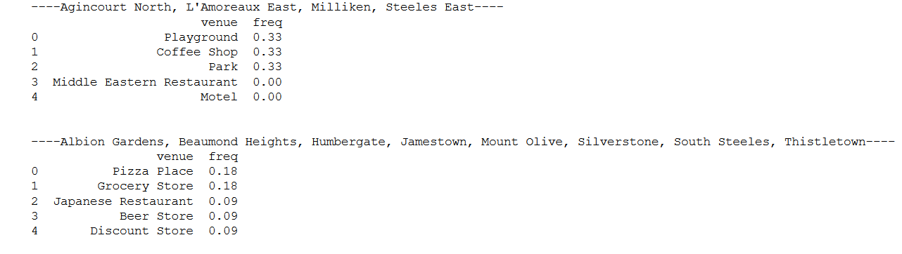
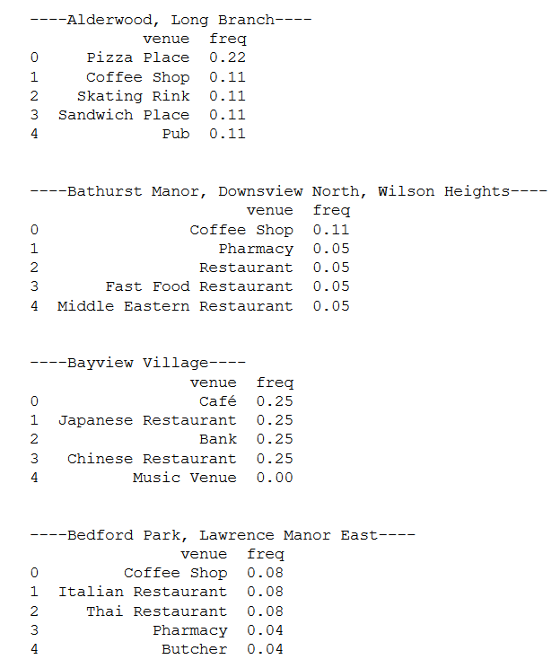
> Neighbourhoods with top 5 most common venues.

#### Final Clusters obtained after Clustering :

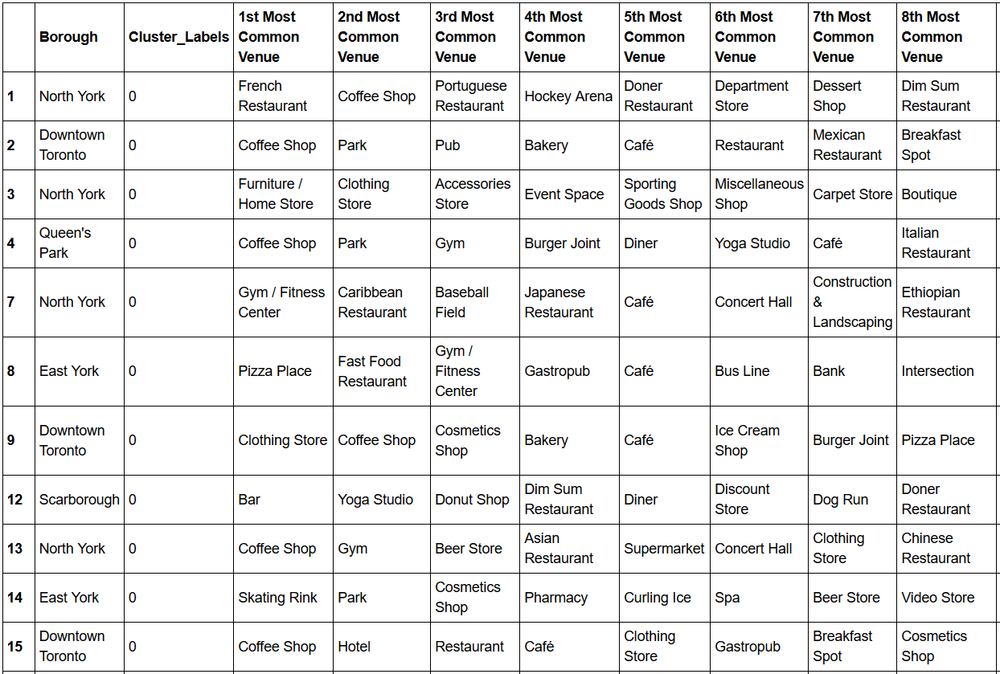
> Cluster-1

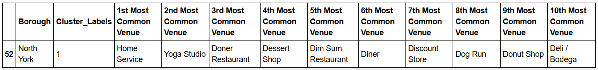
> Cluster-2

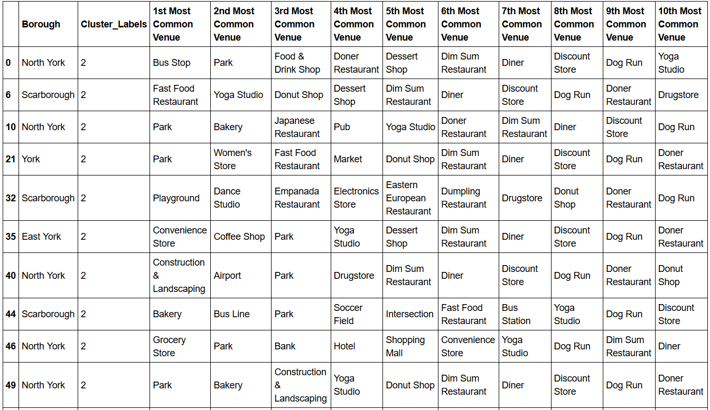
> Cluster-3

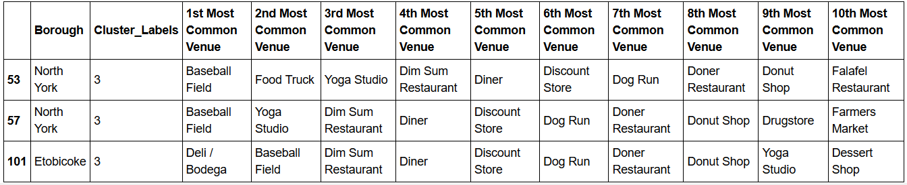
> Cluster-4

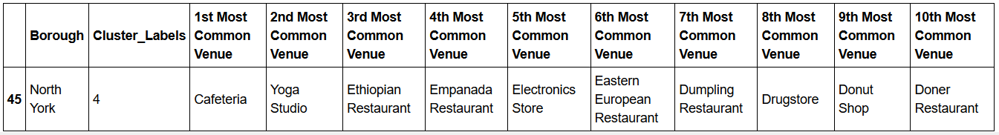
> Cluster-5

### For further information

Please review the narrative of our analysis in [our jupyter notebook](./Segmenting%20and%20Clustering%20neighbourhood%20.ipynb)

For any additional questions, please contact **shaileshshettyd@gmail.com)

##### Repository Structure:

```
├── README.md                                                           <- The top-level README for reviewers of this project.
├── Segmenting and Clustering neighbourhood.ipynb              <- narrative documentation of analysis in jupyter notebook
└── images                                                              <- both sourced externally and generated from code
```
